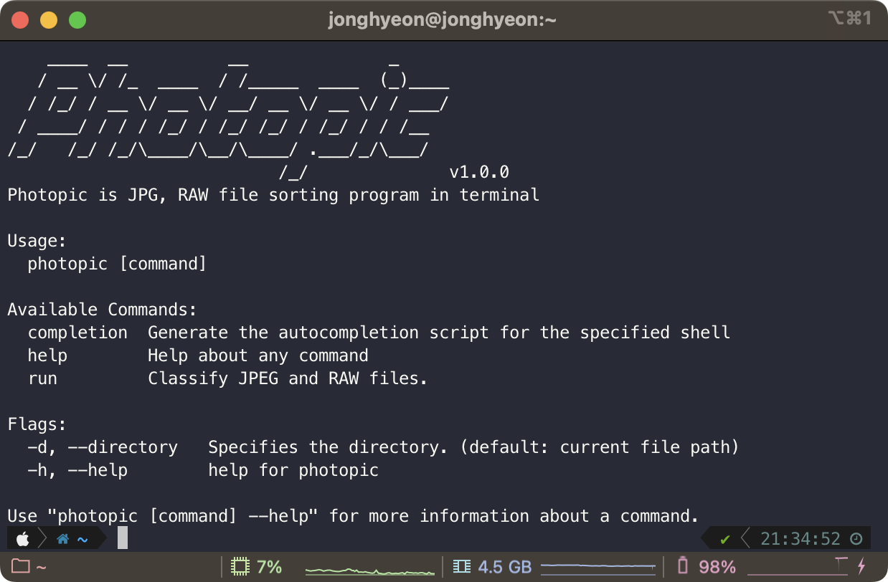

## Photopic



JPG, RAW file sorter program in terminal written golang

### How to install

```bash
$ git clone https://github.com/jonghyeons/photopic.git
$ cd photopic
$ go install
```

### Usage

```bash
# Show help
$ photopic --help

# Run in current filepath
$ photopic run

# Run another filepath
$ photopic run YOUR_FILE_PATH
```

### Directory after running

```bash
+-- /FILEPATH
    +-- /jpg
    +-- /raw
```
